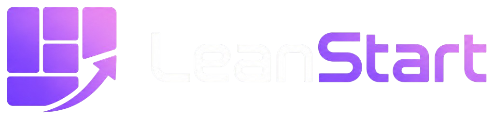

# 🚀 LeanStart


## 📖 Descripción

LeanStart es una plataforma web diseñada para apoyar a emprendedores en la creación, validación y evaluación de ideas de negocio mediante la metodología Lean Canvas.

La aplicación permite registrar mini empresas, productos o servicios, construir modelos de negocio, validar hipótesis, recibir mentorías y obtener evaluaciones de viabilidad.

El sistema implementa una arquitectura SOFEA (Service-Oriented Front-End Architecture), utilizando Next.js para el frontend y NestJS para los servicios backend, incorporando además un sistema de privilegios dinámicos por módulo y acción.

---

# 🎯 Objetivo

Facilitar el desarrollo de ideas de negocio mediante una plataforma colaborativa donde emprendedores, mentores, evaluadores y administradores interactúan para validar y fortalecer propuestas empresariales antes de su lanzamiento al mercado.

---

# 👥 Roles del Sistema

## Emprendedor

Responsable de:

* Crear mini empresas.
* Registrar productos o servicios.
* Construir Lean Canvas.
* Registrar hipótesis y experimentos.
* Consultar observaciones.
* Enviar proyectos a mentoría y evaluación.
* Consultar score de viabilidad.

## Mentor

Responsable de:

* Revisar proyectos asignados.
* Analizar Lean Canvas.
* Revisar hipótesis y experimentos.
* Validar o invalidar hipótesis.
* Registrar observaciones.
* Dar seguimiento a correcciones.

## Evaluador

Responsable de:

* Revisar proyectos asignados.
* Evaluar ideas mediante rúbricas.
* Asignar puntuaciones.
* Emitir comentarios finales.
* Determinar la viabilidad del proyecto.

## Administrador

Responsable de:

* Gestionar usuarios.
* Gestionar roles.
* Gestionar privilegios.
* Asignar mentores.
* Asignar evaluadores.
* Configurar criterios de evaluación.
* Configurar score de viabilidad.
* Consultar reportes generales.

---

# 🏢 Módulos Principales

## Mini Empresas

Permite registrar:

* Logotipo
* Nombre
* Giro / Categoría
* Descripción
* Mercado objetivo
* Estado del proyecto

## Productos y Servicios

Permite registrar:

* Nombre
* Descripción
* Tipo
* Precio estimado
* Características

## Lean Canvas

Incluye:

* Problema
* Segmentos de clientes
* Propuesta de valor
* Solución
* Canales
* Fuentes de ingreso
* Estructura de costos
* Métricas clave
* Ventaja injusta

## Validación de Hipótesis

Permite:

* Crear hipótesis
* Diseñar experimentos
* Registrar resultados
* Adjuntar evidencias
* Obtener validación por mentor

## Mentorías

Permite:

* Revisar proyectos
* Registrar observaciones
* Dar seguimiento
* Validar hipótesis

## Evaluaciones

Permite:

* Aplicar criterios de evaluación
* Calcular puntuación final
* Generar comentarios
* Determinar viabilidad

## Reportes

Permite consultar:

* Empresas registradas
* Usuarios activos
* Proyectos evaluados
* Scores de viabilidad

---

# 🔐 Sistema de Privilegios Dinámicos

El sistema implementa permisos por módulo y acción.

## Acciones soportadas

* Ver
* Crear
* Editar
* Eliminar
* Aprobar
* Exportar

Los privilegios controlan:

* Menús dinámicos
* Botones dinámicos
* Acciones protegidas
* Validaciones backend

---

# 📊 Estados de Proyecto

* Borrador
* Pendiente de mentoría
* En mentoría
* Observaciones pendientes
* Observaciones atendidas
* Pendiente de evaluación
* En evaluación
* Evaluado
* Publicado
* Devuelto

---

# 📈 Score de Viabilidad

El score se calcula utilizando:

* Evaluación final
* Hipótesis validadas

Configuración inicial:

| Componente | Peso |
| ---------- | ---- |
| Evaluación | 80%  |
| Hipótesis  | 20%  |

## Niveles de Viabilidad

| Nivel | Rango    |
| ----- | -------- |
| Baja  | 0 - 49   |
| Media | 50 - 74  |
| Alta  | 75 - 100 |

---

# 🛠️ Stack Tecnológico

## Frontend

* Next.js
* TypeScript
* Tailwind CSS

## Backend

* NestJS
* TypeScript

## Base de Datos

* PostgreSQL

## Infraestructura

* Railway (despliegue por servicio: api-gateway, auth-service, empresas-service, evaluaciones-service, notificaciones-service, web-shell, Alexa — cada uno con su propio `railway.json`/Dockerfile)
* Upstash Redis (gestionado, TLS) para rate-limiting de login
* Migración planeada a AWS (RDS, S3, y evaluando Amplify/ECS para el resto) como siguiente etapa, una vez cerrado el alcance funcional actual

## Seguridad

* JWT Authentication
* RBAC + Privilegios Dinámicos

---

# 🏗️ Arquitectura

```text
Frontend (Next.js)
        │
        ▼
API Gateway (NestJS)
        │
 ┌──────┼──────┐
 ▼      ▼      ▼
Auth  Projects Reports
        │
        ▼
 PostgreSQL
```

---

# 📋 Funcionalidades Principales

* Registro de usuarios.
* Inicio de sesión.
* Gestión de roles.
* Gestión de privilegios.
* Creación de mini empresas.
* Registro de productos.
* Construcción de Lean Canvas.
* Registro de hipótesis.
* Diseño de experimentos.
* Validación de hipótesis.
* Sistema de observaciones.
* Mentorías.
* Evaluaciones.
* Score de viabilidad.
* Reportes.
* Dashboard personalizado por rol.

---

# 🚀 Funcionalidades Avanzadas

* Galería pública de proyectos.
* Exportación de reportes.
* Integración con Alexa Skills.

---

